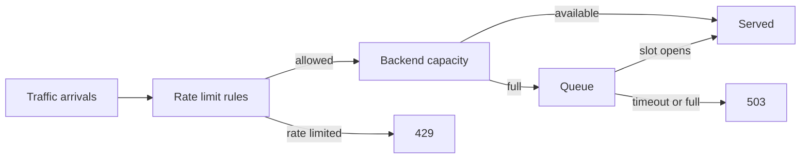

# Rate Limiter Simulator

Browser simulator for traffic, sliding-window rate limits, queue pressure, backend latency, `429`, and `503` outcomes.

Demo: https://ratelimit-simulator.pages.dev/

## Design



## Run locally

```bash
python3 -m http.server 8080
```

Open `http://localhost:8080`.
